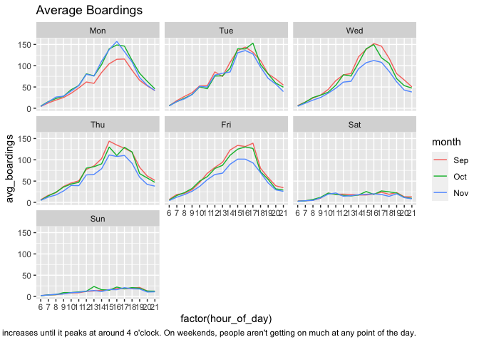
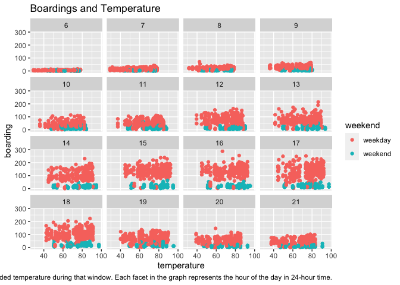
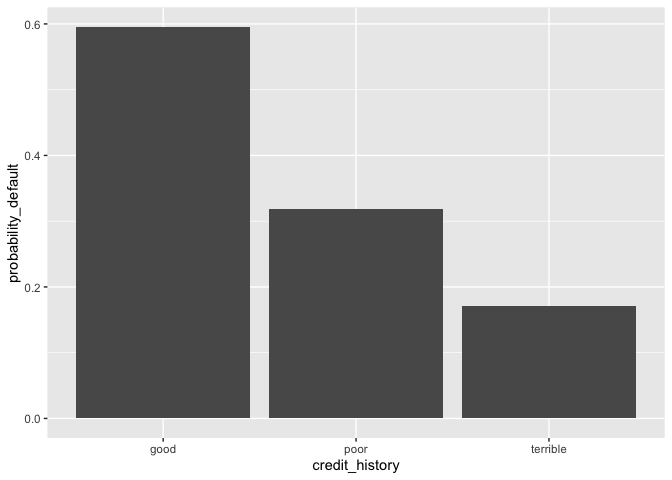
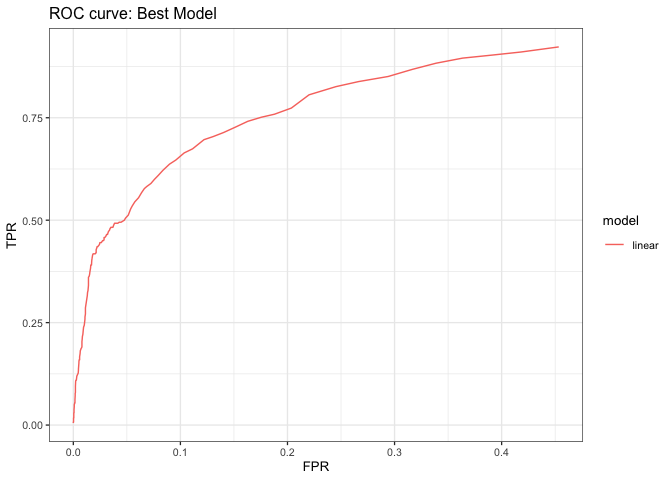

## 1) Visualization



The hour of peak boarding times seem to stay constant day to day, month
to month.

During Mondays in September, average boarding looks lower compared to
other days and months. One possible reason for this is that weather in
September 2018 was more pleasant than the colder October and November
months. This may have incentivized people to go out more on Sundays
rendering it difficult to get up on Monday mornings to go to work.

Wednesday, Thursday, Friday look lower in November because the week of
Thanksgiving break (November 21-23 in 2018) may have lowered the
averages down for the rest of the month because a lot of students and
others would be going back to home.



Temperature seems to not have a noticeable effect on ridership among UT
students when holding hour of day and weekend status constant.

## 2) Saratoga house prices

The linear model produces the lowest RMSE. Using this model allows for
more control over variables and features as well as interactions between
them. In the linear model, I interacted living area with number of
rooms,number of rooms with number of bedrooms, and bedrooms and
bathrooms.

The optimal K for the RMSE model is 5.466596^{4}

### Appendix

    ##      Linear_Model KNN_Model
    ## RMSE     66519.74  54665.96

Comparison of the RMSE for the each model

    ## 
    ## Call:
    ## lm(formula = price ~ . + (livingArea:rooms) + (rooms:bedrooms) + 
    ##     (bedrooms:bathrooms) - pctCollege - sewer - waterfront - 
    ##     landValue - newConstruction, data = saratoga_train)
    ## 
    ## Coefficients:
    ##            (Intercept)                 lotSize                     age  
    ##              36126.948               11500.386                  31.662  
    ##             livingArea                bedrooms              fireplaces  
    ##                 25.647               23739.504                4152.048  
    ##              bathrooms                   rooms  heatinghot water/steam  
    ##              21429.004                5075.901               -9337.009  
    ##        heatingelectric            fuelelectric                 fueloil  
    ##                -15.775              -15449.269              -10743.925  
    ##           centralAirNo        livingArea:rooms          bedrooms:rooms  
    ##             -19740.276                   7.861               -5047.548  
    ##     bedrooms:bathrooms  
    ##                 77.670

## 3) Classification and retrospective sampling



    ##    yhat
    ## y     0   1
    ##   0 121  15
    ##   1  44  20

    ## 
    ## Call:  glm(formula = Default ~ duration + amount + installment + age + 
    ##     history + purpose + foreign, family = "binomial", data = credit_train)
    ## 
    ## Coefficients:
    ##         (Intercept)             duration               amount  
    ##          -0.3456265            0.0255723            0.0000825  
    ##         installment                  age          historypoor  
    ##           0.1778595           -0.0238161           -1.1165329  
    ##     historyterrible           purposeedu  purposegoods/repair  
    ##          -1.8628303            0.7624718           -0.0108355  
    ##       purposenewcar       purposeusedcar        foreigngerman  
    ##           0.8250028           -0.8771818           -1.0846379  
    ## 
    ## Degrees of Freedom: 799 Total (i.e. Null);  788 Residual
    ## Null Deviance:       970.5 
    ## Residual Deviance: 849.9     AIC: 873.9

The bar plot along with the regression implies that the historypoor and
historyterrible variables are negatively correlated with default
probability which doesn’t make a lot of sense. Given that a big majority
of the sample are “poor” or “terrible” credit scores, history isn’t a
good variable to use in this dataset to predict “high” or “low”
probability of default. And since the bank looked for similar types of
loans that caused defaults this dataset would be looking for probability
of defaulting among loans that are already biased towards defaulting in
the first place. So, they should sample a random or bigger variety of
loan types.

## 4) Children and hotel reservations

### Model building

    ##    yhat
    ## y      0
    ##   0 8263
    ##   1  737

    ##    yhat
    ## y      0    1
    ##   0 8155  108
    ##   1  462  275

    ##    yhat
    ## y      0    1
    ##   0 8161  102
    ##   1  463  274

    ##                    baseline_1 baseline_2  my_model
    ## Out_of_sample_prob  0.9181111  0.9366667 0.9372222

Using the confusion matrices to tabulate predicted vs actual class, I’m
able to to measure out-of-sample accuracy for each model.

### Model validation: step 1



<!-- ### Model validation: step 2 -->
<!-- ```{r, echo=FALSE, warning=FALSE, message=FALSE} -->
<!-- k_folds = 20 -->
<!-- hotels_val_f = hotels_val %>% -->
<!--   mutate(fold_id = rep(1:k_folds, length=nrow(hotels_val)) %>% sample) -->
<!-- ``` -->
