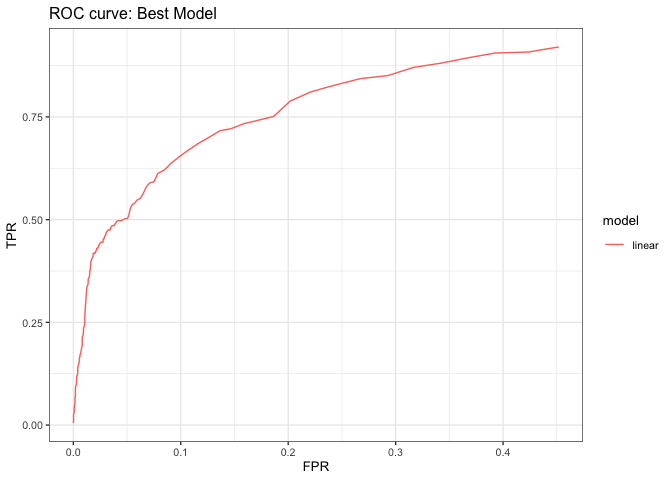

## 1) Visualization


The hour of peak boarding times seem to stay constant day to day, month
to month.

During Mondays in September, average boarding looks lower compared to
other days and months. One possible reason for this is that weather in
September 2018 was more pleasant than the colder October and November
months. This may have incentivized people to go out more on Sundays
rendering it difficult to get up on Monday mornings to go to work.

Wednesday, Thursday, Friday look lower in November because the week of
Thanksgiving break (November 21-23 in 2018) may have lowered the
averages down for the rest of the month because a lot of students and
others would be going back to home.


Temperature seems to not have a noticeable effect on ridership among UT
students when holding hour of day and weekend status constant.

## 2) Saratoga house prices

The linear model produces the lowest RMSE. Using this model allows for
more control over variables and features as well as interactions between
them. In the linear model, I interacted living area with number of
rooms,number of rooms with number of bedrooms, and bedrooms and
bathrooms.

The optimal K for the RMSE model is 6.8526252^{4}

### Appendix

Comparison of the RMSE for the each model

    ##      Linear_Model KNN_Model
    ## RMSE     65469.85  68526.25

Regression output for linear model

    ## 
    ## Call:
    ## lm(formula = price ~ . + (livingArea:rooms) + (rooms:bedrooms) + 
    ##     (bedrooms:bathrooms) - pctCollege - sewer - waterfront - 
    ##     landValue - newConstruction, data = saratoga_train)
    ## 
    ## Coefficients:
    ##            (Intercept)                 lotSize                     age  
    ##              33335.039                9366.802                 107.516  
    ##             livingArea                bedrooms              fireplaces  
    ##                 17.165               26049.765                4499.091  
    ##              bathrooms                   rooms  heatinghot water/steam  
    ##              31241.004                3648.282               -6946.544  
    ##        heatingelectric            fuelelectric                 fueloil  
    ##              -4197.492              -14006.549              -15400.110  
    ##           centralAirNo        livingArea:rooms          bedrooms:rooms  
    ##             -18911.530                   8.394               -4888.195  
    ##     bedrooms:bathrooms  
    ##              -1492.570

## 3) Classification and retrospective sampling


    ##    yhat
    ## y     0   1
    ##   0 121   8
    ##   1  59  12

    ## 
    ## Call:  glm(formula = Default ~ duration + amount + installment + age + 
    ##     history + purpose + foreign, family = "binomial", data = credit_train)
    ## 
    ## Coefficients:
    ##         (Intercept)             duration               amount  
    ##          -8.054e-01            2.872e-02            8.278e-05  
    ##         installment                  age          historypoor  
    ##           1.834e-01           -1.419e-02           -1.171e+00  
    ##     historyterrible           purposeedu  purposegoods/repair  
    ##          -1.874e+00            7.621e-01            5.510e-02  
    ##       purposenewcar       purposeusedcar        foreigngerman  
    ##           7.250e-01           -9.387e-01           -9.039e-01  
    ## 
    ## Degrees of Freedom: 799 Total (i.e. Null);  788 Residual
    ## Null Deviance:       958 
    ## Residual Deviance: 840.5     AIC: 864.5

The bar plot along with the regression implies that the historypoor and
historyterrible variables are negatively correlated with default
probability which doesn’t make a lot of sense. Given that a big majority
of the sample are “poor” or “terrible” credit scores, history isn’t a
good variable to use in this dataset to predict “high” or “low”
probability of default. And since the bank looked for similar types of
loans that caused defaults this dataset would be looking for probability
of defaulting among loans that are already biased towards defaulting in
the first place. So, they should sample a random or bigger variety of
loan types.

## 4) Children and hotel reservations

### Model building

    ##    yhat
    ## y      0
    ##   0 8297
    ##   1  703

    ##    yhat
    ## y      0    1
    ##   0 8196  101
    ##   1  457  246

    ##    yhat
    ## y      0    1
    ##   0 8198   99
    ##   1  451  252

    ##                    baseline_1 baseline_2  my_model
    ## Out_of_sample_prob  0.9218889  0.9380000 0.9388889

Using the confusion matrices to tabulate predicted vs actual class, I’m
able to to measure out-of-sample accuracy for each model.

### Model validation: step 1



<!-- ### Model validation: step 2 -->
<!-- ```{r, echo=FALSE, warning=FALSE, message=FALSE} -->
<!-- k_folds = 20 -->
<!-- hotels_val_f = hotels_val %>% -->
<!--   mutate(fold_id = rep(1:k_folds, length=nrow(hotels_val)) %>% sample) -->
<!-- ``` -->
